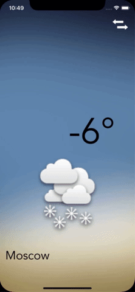

# GetWeatherApp

GetWeatherApp is a location-aware weather application.
It will find out where you are in the world and query an open source weather service to retrieve the temperature and weather conditions.
Also, you can change the city at the tap of a button.

This app shows my basic skills with using: 
* CocoaPods (Alamofire, SwiftyJSON)
* CoreLocation
* API fetching
* JSON parsing
* Delegates and Protocols 

